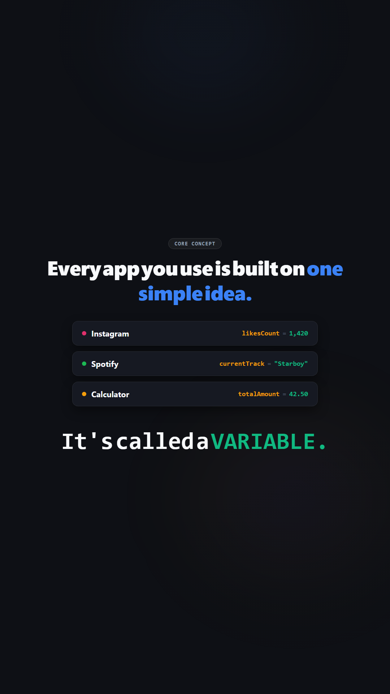
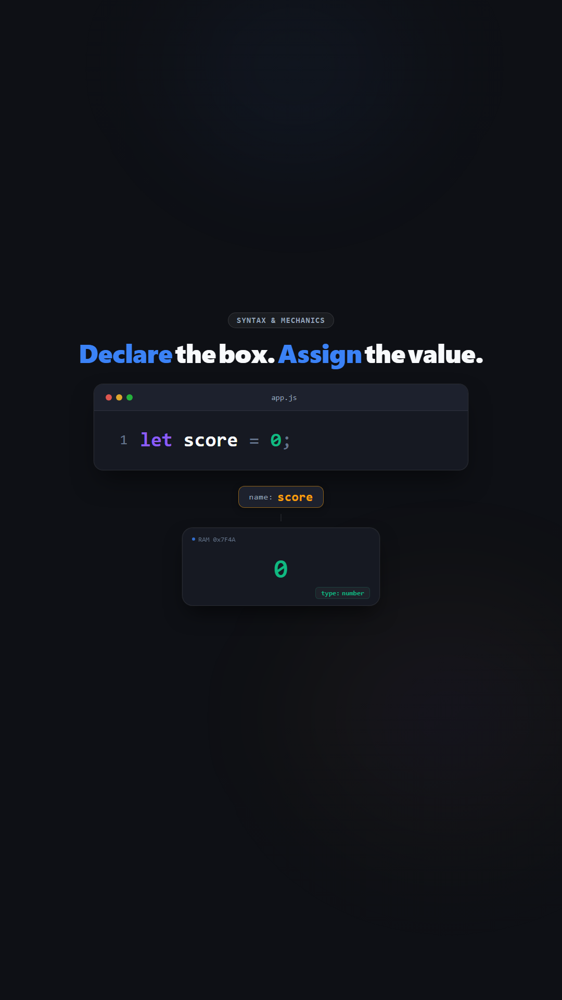
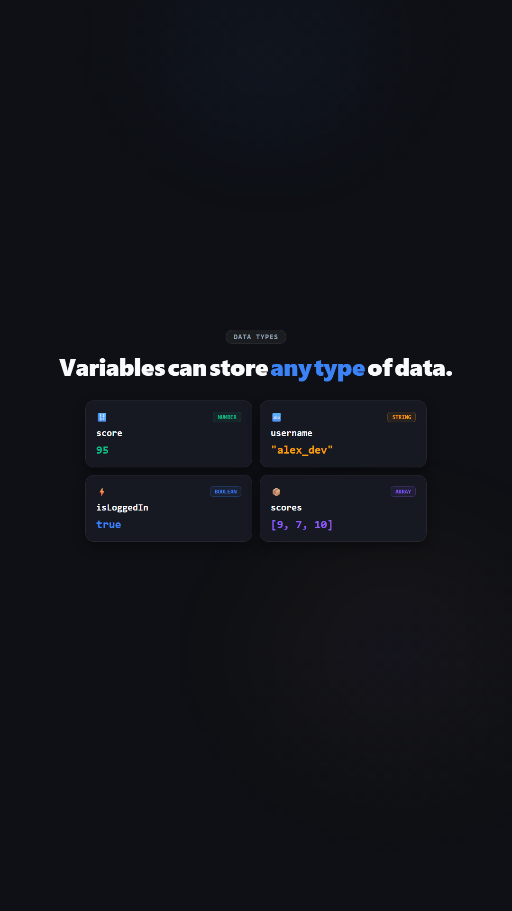

# 🚀 "Variables" — Modern Motion Graphics Explainer

A production-ready **vertical (1080×1920, 9:16)** kinetic motion video explaining the fundamental programming concept of **Variables**, built with **Remotion** and automated neural voiceover.

---

## 🎬 Demo

<p align="center">
  
  
  
</p>

> 📥 **Download & Watch Full Video**: [assets/variables.mp4](assets/variables.mp4)
>
> ⚠️ GitHub can't play large `.mp4` files inline. To watch, click **"View raw"** on the link above to download, or clone the repo and open `assets/variables.mp4` locally.

---

## 🌟 Features & Highlights

- 🎙️ **1-Click Free Neural Voiceover (`npm run audio`)**: Uses Microsoft Edge Neural TTS (`en-US-ChristopherNeural`) with 0 API keys required. It generates scene audio, computes exact timestamps, and auto-calibrates `src/tokens.ts` scene frame counts.
- 🎨 **Editorial Motion Design (Human-Crafted Aesthetic)**:
  - `BackgroundGlow`: Warm obsidian canvas with soft diffuse studio lighting (gentle key and fill bokeh pools).
  - `CodeWindow`: macOS dark-mode code editor with syntax highlighting and realistic typing animation.
  - `VariableBox`: 3D tactile memory container with RAM address tag (`0x7F4A`) and spring 3D flip animation upon reassignment.
  - `DataTypes` & `NamingRules`: Visual pass/fail cards and multi-type badges (Numbers, Strings, Booleans with toggles, Arrays).
- 📱 **Dual Format Support**: Render in 9:16 vertical (Reels/Shorts/TikTok) or 16:9 landscape (YouTube).

---

## ⚡ 3-Step Quick Start (Beginner Friendly)

### 1. Generate Voiceover Audio (100% Free & Automated)
```bash
npm run audio
```
> This runs `scripts/generate_audio.py`, generates `public/voiceover.mp3`, and syncs all scene durations inside `src/tokens.ts` automatically!

### 2. Preview Live in Remotion Studio
```bash
npm start
```
> Opens Remotion Studio in your browser at `http://localhost:3000`. You can scrub through the timeline, play with audio, inspect frame-by-frame, and watch your edits hot-reload instantly.

### 3. Render Final MP4 Video
```bash
npm run build
```
> Outputs the final high-definition MP4 file to `out/variables.mp4` ready for Instagram Reels, YouTube Shorts, or TikTok!
> For 16:9 YouTube landscape format: `npm run build:landscape`.

---

## 🛠️ How to Customize

### Change the Voice or Narration
Open `scripts/generate_audio.py` and choose any neural voice:
- `en-US-ChristopherNeural` (Default: calm, authoritative, smooth)
- `en-US-GuyNeural` (Casual, energetic tech narrator)
- `en-US-JennyNeural` (Natural, friendly female narrator)
- `en-US-EricNeural` (Contemporary conversational)

Run `npm run audio` after editing script text or voice to regenerate and re-sync everything in seconds!

### If You Prefer ElevenLabs
1. Generate your audio on [elevenlabs.io](https://elevenlabs.io) using the text in `narration-script.md`.
2. Save the file as `public/voiceover.mp3`.
3. Adjust the seconds in `src/tokens.ts` (`SCENE_SECONDS`) to match your ElevenLabs track duration.

### Change Colors & Styling
Open `src/tokens.ts` to tweak the design palette:
- `colors.bg`: Canvas background (warm obsidian `#0E1015`)
- `colors.value`: Color of data values (clean emerald `#10B981`)
- `colors.label`: Color of variable names (warm amber `#F59E0B`)
- `colors.keyword`: Color of `let` / `const` (soft violet `#8B5CF6`)
- `colors.accent`: Accent highlights (cobalt `#3B82F6`)

---

## 📂 Project Structure

```text
variables-video/
├── assets/                    # Demo video file & visual assets
│   └── variables.mp4          # Rendered MP4 demo video
├── scripts/
│   └── generate_audio.py      # Automated neural TTS generator & sync engine
├── public/
│   └── voiceover.mp3          # Master narration audio track
├── src/
│   ├── components/
│   │   ├── BackgroundGlow.tsx # Diffuse ambient studio lighting
│   │   ├── CodeWindow.tsx     # Syntax-highlighted code editor window
│   │   ├── KineticText.tsx    # Spring-physics animated typography
│   │   └── VariableBox.tsx    # 3D tactile memory container
│   ├── scenes/
│   │   ├── Hook.tsx           # Scene 1: App variables intro
│   │   ├── WhatIsVariable.tsx # Scene 2: Labeled box metaphor
│   │   ├── DeclareAssign.tsx  # Scene 3: let score = 0 declaration
│   │   ├── NamingRules.tsx    # Scene 4: Valid vs invalid rules
│   │   ├── Reassignment.tsx   # Scene 5: 3D flip & memory mutation
│   │   ├── DataTypes.tsx      # Scene 6: Numbers, Strings, Booleans, Arrays
│   │   └── Recap.tsx          # Scene 7: 3 key takeaways & Next: Functions
│   ├── Root.tsx               # Remotion root compositions (Vertical & Landscape)
│   ├── Video.tsx              # Main video composition & sequence controller
│   ├── index.ts               # Entry point
│   └── tokens.ts              # Design tokens, palette & calibrated timings
├── narration-script.md        # Reference script with timecodes
└── package.json
```
